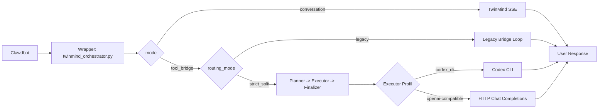
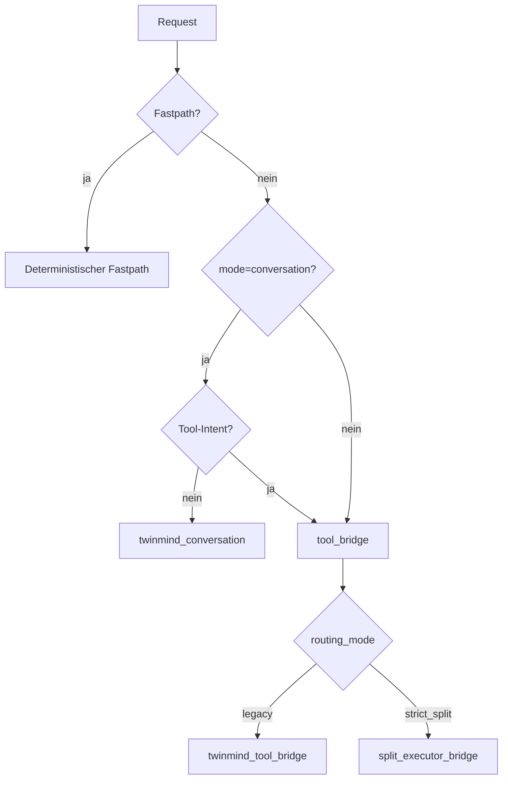

# TwinMind Split Kit

Diese Startseite fuehrt neue Nutzer Schritt fuer Schritt durch Split-Logik, TwinMind Wrapper und sichere Migration.

## Fuer wen ist dieses Repo?
- Fuer Nutzer, die verstehen wollen, wie der TwinMind Wrapper arbeitet.
- Fuer Nutzer, die die Split-Logik (`legacy bridge` vs `strict_split`) sicher einsetzen wollen.
- Fuer Nutzer, die von Standard-Clawdbot auf diese Architektur migrieren moechten.

## Schnellstart in 6 Schritten
1. Grundidee lesen: [docs/00-start-here.md](./docs/00-start-here.md)
2. Split-Routing verstehen: [docs/03-split-routing.md](./docs/03-split-routing.md)
3. Modellprofil waehlen (Codex oder Alternative): [docs/10-model-profiles-and-credentials.md](./docs/10-model-profiles-and-credentials.md)
4. Runtime-Secrets sicher beschaffen und setzen: [docs/11-token-sourcing-safe.md](./docs/11-token-sourcing-safe.md)
5. Migration immer zuerst mit `plan`: [docs/05-migration-guide.md](./docs/05-migration-guide.md)
6. Betrieb/Checks nachziehen: [docs/06-operations-runbook.md](./docs/06-operations-runbook.md)

## Split-Logik einfach erklaert
- `conversation`: Wrapper fragt TwinMind direkt, ohne striktes Tool-Protokoll.
- `tool_bridge`: Wrapper erzwingt ein strukturiertes Tool-Protokoll (`tool_call`/`final`).
- `legacy bridge`: Ein Bridge-Pfad ohne harte Planner/Executor-Aufteilung.
- `strict_split`: TwinMind plant/finalisiert, ein externer Executor fuehrt deterministisch aus.

Merksatz:
- `legacy bridge` = kompatibler Ein-Bruecken-Flow.
- `strict_split` = klar getrennte Rollen (Planner -> Executor -> Finalizer).

<details>
<summary><strong>Was ist die Legacy Bridge genau, wann wird sie gewaehlt, und warum?</strong></summary>

Die `legacy bridge` ist der kompatible Bridge-Modus im `tool_bridge`, bei dem kein harter Planner/Executor-Split erzwungen wird.

**Warum wird sie gewaehlt?**
- wenn ein durchgaengiger Ein-Bruecken-Flow genuegt
- wenn Kompatibilitaet wichtiger ist als maximale Rollentrennung

**Beispiel:**
- Nutzer: "Zeig mir bitte meine aktuellen Sharezone-Hausaufgaben."
- Route: `tool_bridge` + `legacy`
- Ablauf: Bridge erzeugt Tool-Aufruf, verarbeitet Tool-Resultat und liefert die Endantwort.

</details>

<details>
<summary><strong>Was sind Fastpaths und wer entscheidet, ob ein Fastpath genutzt wird?</strong></summary>

Fastpaths sind deterministische Kurzrouten im Wrapper. Sie umgehen den normalen Modell-/Bridge-Ablauf fuer klar erkennbare Spezialfaelle.

**Wer entscheidet das?**
- Der Wrapper ueber feste Matcher/Regeln im Routing-Code.

**Beispiele:**
- "[cron] Run Schulcloud daily" -> Cron-Fastpath
- "HEARTBEAT Status?" -> Heartbeat-Fastpath

**Nutzen:**
- weniger Latenz
- weniger unnoetige Modellaufrufe
- stabileres Verhalten bei standardisierten Tasks

</details>

## Modelle im Split-Pfad
Der aktuelle Converter und das Replica-Skript patchen standardmaessig:
- `ORCH_EXECUTOR_PROVIDER=codex_cli`
- `ORCH_EXECUTOR_MODEL=gpt-5.3-codex`

Alternative Modelle sind trotzdem moeglich, indem nach der Migration die bestehenden `ORCH_EXECUTOR_*` Variablen angepasst werden.

| Profil | Executor-Provider | Typischer Einsatz |
|---|---|---|
| Codex (Default) | `codex_cli` | Lokale Codex-CLI-Ausfuehrung im `strict_split`-Executor |
| OpenAI-kompatibel (z. B. Gemini-kompatibles Endpoint) | `openai` / `openai_codex` / `codex` | HTTP-Executor ueber `ORCH_EXECUTOR_BASE_URL` + API-Key |

Hinweis fuer Codex 5.3:
- Im Defaultprofil (`codex_cli`) kommt die Auth aus der lokalen Codex-CLI-OAuth-Session, nicht aus einem statischen API-Key.

<details>
<summary><strong>Warum bleibt Codex Default, obwohl Gemini moeglich ist?</strong></summary>

Die Skripte sind aktuell auf einen stabilen Codex-Standardpfad ausgelegt. So bleiben Migration und Replica reproduzierbar.

Andere Modelle werden nicht blockiert, sondern als Nachkonfiguration unterstuetzt. Das reduziert Risiko in der Basis-Migration und erlaubt trotzdem flexible Provider-Wahl.

</details>

## Architektur auf einen Blick


## Routing-Entscheidung


## Unterschied zu Standard-Clawdbot

| Bereich | Standard-Clawdbot | Dieses Repo (TwinMind Split Kit) | Wirkung |
|---|---|---|---|
| Primaeres Backend | Standard Provider/Agent-Flow | TwinMind Wrapper als CLI-Backend | Einheitliches Wrapper-Routing |
| Routing | Kein expliziter Split-Mechanismus | `legacy bridge` + `strict_split` | Kontrollierbare Ausfuehrungswege |
| Tool-Orchestrierung | Provider-abhaengig | JSON-Protokoll in `tool_bridge` | Deterministischere Tool-Schritte |
| Modellwahl im Split-Pfad | Provider intern | Dokumentierte Executor-Profile | Klarere Multi-Model-Konfiguration |
| Finalisierung | Direkt aus Provider-Pfad | Optional TwinMind-Finalizer in `strict_split` | Konsistentere Nutzerantwort |
| Migration/Rollback | Kein dediziertes Kit | `plan/apply/rollback` Skripte + Manifest | Sicherere Umstellung |
| Replizierbarkeit | Manuell | Replica-Bootstrap-Skript | Schneller Neuaufbau |

## Code-Struktur und Verantwortlichkeiten
- [vendor/](./vendor/) Runtime-Kern
  - [twinmind_orchestrator.py](./vendor/twinmind_orchestrator.py): Hauptlogik
  - [twinmind_memory_sync.py](./vendor/twinmind_memory_sync.py): Memory-Sync
  - [twinmind_memory_query.py](./vendor/twinmind_memory_query.py): Memory-Query
- [scripts/](./scripts/) Betrieb und Migration
  - [convert_clawdbot_to_split.sh](./scripts/convert_clawdbot_to_split.sh)
  - [bootstrap_clawdbot_replica.sh](./scripts/bootstrap_clawdbot_replica.sh)
  - [safe_push.sh](./scripts/safe_push.sh)
- [docs/](./docs/) Onboarding, Architektur, Betrieb
- [templates/](./templates/) Patch- und Env-Vorlagen
- [manifests/](./manifests/) Migrationsschema und erzeugte Manifeste
- [analysis/](./analysis/) Line-Refs und Architektur-Mapping

## Lesewege nach Ziel
- Ich bin neu:
  - [00-start-here](./docs/00-start-here.md)
  - [01-overview](./docs/01-overview.md)
  - [10-model-profiles-and-credentials](./docs/10-model-profiles-and-credentials.md)
  - [11-token-sourcing-safe](./docs/11-token-sourcing-safe.md)
- Ich migriere/betreibe:
  - [05-migration-guide](./docs/05-migration-guide.md)
  - [06-operations-runbook](./docs/06-operations-runbook.md)
  - [07-troubleshooting](./docs/07-troubleshooting.md)
  - [08-rollback](./docs/08-rollback.md)
- Ich will tief technisch einsteigen:
  - [02-wrapper-architecture](./docs/02-wrapper-architecture.md)
  - [03-split-routing](./docs/03-split-routing.md)
  - [09-script-reference](./docs/09-script-reference.md)

## Sicherheitsregeln
- Keine Migration automatisch ausfuehren.
- Immer zuerst `plan`.
- Keine Credentials committen.
- Runtime-Secrets nur lokal in `.env` halten.
- Vor Push immer [scripts/safe_push.sh](./scripts/safe_push.sh).

## Schnellbefehle
Migration planen:
```bash
/root/twinmind-split-kit/scripts/convert_clawdbot_to_split.sh --mode plan --config /root/.clawdbot/clawdbot.json
```

Replica dry-run:
```bash
/root/twinmind-split-kit/scripts/bootstrap_clawdbot_replica.sh --mode plan --target-root /root/.clawdbot-replica
```

Private Repo Push dry-run:
```bash
/root/twinmind-split-kit/scripts/init_private_repo_and_push.sh --owner <your-github-user> --repo clawdbot-twinmind-split-kit --dry-run 1
```

## Erforderliche Runtime-Secrets
- `TWINMIND_REFRESH_TOKEN`
- `TWINMIND_FIREBASE_API_KEY`

Details zur Beschaffung und sicheren Ablage:
- [docs/11-token-sourcing-safe.md](./docs/11-token-sourcing-safe.md)

Kurzkontext:
- Quelle ist typischerweise die eigene TwinMind Browser-Extension-Session (DevTools), z. B. `https://chromewebstore.google.com/detail/twinmind-chat-with-tabs-m/agpbjhhcmoanaljagpoheldgjhclepdj`.

## Provenance
- [vendor/PROVENANCE.md](./vendor/PROVENANCE.md)
