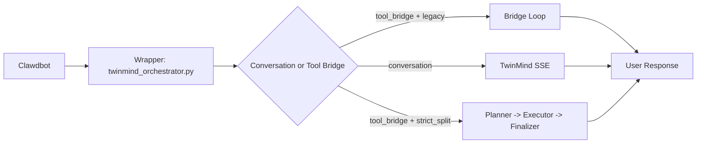

# TwinMind Split Kit

Architecture-first repository for the TwinMind wrapper and split routing logic used by Clawdbot.

## Architecture First
Start here:
- [docs/00-start-here.md](./docs/00-start-here.md)

Core runtime files:
- [vendor/twinmind_orchestrator.py](./vendor/twinmind_orchestrator.py)
- [vendor/twinmind_memory_sync.py](./vendor/twinmind_memory_sync.py)
- [vendor/twinmind_memory_query.py](./vendor/twinmind_memory_query.py)

## Primary Runtime Topology


## Repository Focus
1. Explain split logic and wrapper behavior in depth
2. Provide deterministic migration and rollback scripts
3. Provide reproducible bootstrap for similar installations
4. Provide safe private GitHub push workflow without committing credentials

## Documentation Map
Architecture and logic (recommended first):
- [docs/00-start-here.md](./docs/00-start-here.md)
- [docs/01-overview.md](./docs/01-overview.md)
- [docs/02-wrapper-architecture.md](./docs/02-wrapper-architecture.md)
- [docs/03-split-routing.md](./docs/03-split-routing.md)
- [docs/04-config-reference.md](./docs/04-config-reference.md)

Scripts and operations:
- [docs/09-script-reference.md](./docs/09-script-reference.md)
- [docs/05-migration-guide.md](./docs/05-migration-guide.md)
- [docs/06-operations-runbook.md](./docs/06-operations-runbook.md)
- [docs/08-rollback.md](./docs/08-rollback.md)
- [docs/07-troubleshooting.md](./docs/07-troubleshooting.md)

## Scripts
- [scripts/convert_clawdbot_to_split.sh](./scripts/convert_clawdbot_to_split.sh)
- [scripts/bootstrap_clawdbot_replica.sh](./scripts/bootstrap_clawdbot_replica.sh)
- [scripts/create_private_github_repo.sh](./scripts/create_private_github_repo.sh)
- [scripts/safe_push.sh](./scripts/safe_push.sh)
- [scripts/init_private_repo_and_push.sh](./scripts/init_private_repo_and_push.sh)

## Safety Rules
- No script auto-runs migration.
- Always run `plan` first.
- Never commit real credentials.
- Use `scripts/safe_push.sh` before every push.

## Quick Commands
Plan migration:
```bash
/root/twinmind-split-kit/scripts/convert_clawdbot_to_split.sh --mode plan --config /root/.clawdbot/clawdbot.json
```

Replica dry-run:
```bash
/root/twinmind-split-kit/scripts/bootstrap_clawdbot_replica.sh --mode plan --target-root /root/.clawdbot-replica
```

Private repo create + safe push dry-run:
```bash
/root/twinmind-split-kit/scripts/init_private_repo_and_push.sh --owner <your-github-user> --repo clawdbot-twinmind-split-kit --dry-run 1
```

## Required Runtime Secrets
- `TWINMIND_REFRESH_TOKEN`
- `TWINMIND_FIREBASE_API_KEY`

Set them in runtime `.env` only (never commit this file).

## Provenance
- [vendor/PROVENANCE.md](./vendor/PROVENANCE.md)
