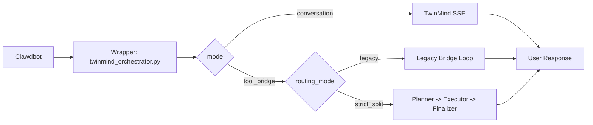
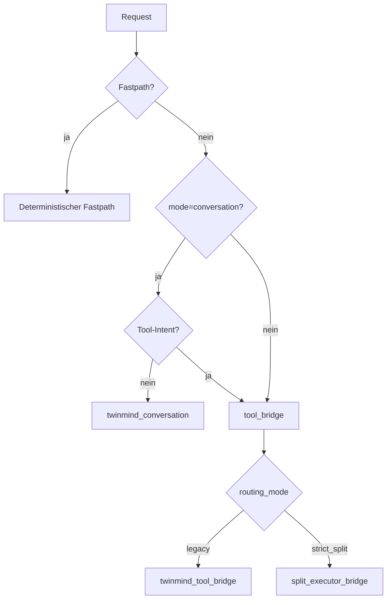

# TwinMind Split Kit

Diese Startseite führt neue Nutzer Schritt für Schritt durch die Architektur, die Unterschiede zu Standard-Clawdbot und den sicheren Einstieg.

## Für wen ist dieses Repo?
- Für Nutzer, die verstehen wollen, wie der TwinMind Wrapper arbeitet.
- Für Nutzer, die die Split-Logik (`legacy bridge` vs `strict_split`) sicher einsetzen wollen.
- Für Nutzer, die von Standard-Clawdbot auf diese Architektur migrieren möchten.

## 5-Minuten Einstieg
1. Verstehe die Grundidee in [docs/00-start-here.md](./docs/00-start-here.md).
2. Lies die Begriffe in [docs/01-overview.md](./docs/01-overview.md).
3. Schau das Routing in [docs/03-split-routing.md](./docs/03-split-routing.md) an.
4. Prüfe Konfiguration in [docs/04-config-reference.md](./docs/04-config-reference.md).
5. Starte Migration immer mit `plan` in [docs/05-migration-guide.md](./docs/05-migration-guide.md).

## Split-Logik einfach erklärt
- `conversation`: Wrapper fragt TwinMind direkt, ohne striktes Tool-Protokoll.
- `tool_bridge`: Wrapper erzwingt ein strukturiertes Tool-Protokoll (`tool_call`/`final`).
- `legacy bridge`: Ein Bridge-Pfad ohne harte Planner/Executor-Aufteilung.
  Der gleiche LLM-Pfad macht Planung, Tool-Aufrufe und Finale in einer Brücke.
- `strict_split`: TwinMind plant/finalisiert, ein externer Executor führt deterministisch aus.

Merksatz:
- `legacy bridge` = kompatibler Ein-Brücken-Flow.
- `strict_split` = klar getrennte Rollen (Planner -> Executor -> Finalizer).

<details>
<summary><strong>Was ist die Legacy Bridge genau, wann wird sie gewählt, und warum?</strong></summary>

Die `legacy bridge` ist der kompatible Bridge-Modus im `tool_bridge`, bei dem kein harter Planner/Executor-Split erzwungen wird.  
Sie wird genutzt, wenn ein stabiler Brücken-Flow ohne zusätzliche Split-Komplexität sinnvoll ist.

**Warum wird sie gewählt?**
- wenn ein durchgängiger Ein-Brücken-Flow genügt
- wenn Kompatibilität und einfacher Ablauf wichtiger sind als strikte Rollentrennung

**Beispiel (realistische Anfrage):**
- Nutzer: „Zeig mir bitte meine aktuellen Sharezone-Hausaufgaben.“
- Route: `tool_bridge` + `legacy`
- Ablauf: Bridge erstellt Tool-Aufruf, verarbeitet Tool-Resultat und liefert direkt die Antwort.

</details>

<details>
<summary><strong>Was sind Fastpaths und wer entscheidet, ob ein Fastpath genutzt wird?</strong></summary>

Fastpaths sind deterministische Kurzrouten im Wrapper. Sie umgehen den normalen Modell-/Bridge-Ablauf für klar erkennbare Spezialfälle.

**Wer entscheidet das?**
- Der Wrapper über feste Matcher/Regeln im Routing-Code.
- Nicht der Nutzer direkt, sondern die erkannte Anfrageform.

**Beispiele (realistische Anfragen):**
- „[cron] Run Schulcloud daily“ -> direkter Cron-Fastpath
- „HEARTBEAT Status?“ -> direkter Heartbeat-Fastpath
- klarer lokaler Spezialfall -> deterministische Skill-Route

**Nutzen:**
- weniger Latenz
- weniger unnötige Modellaufrufe
- stabileres Verhalten bei standardisierten Tasks

</details>

<details>
<summary><strong>Wie funktioniert das Tool-Protokoll (`tool_call` / `final`) praktisch?</strong></summary>

Im `tool_bridge` erwartet der Wrapper strukturierte Antworten:
- `tool_call`: führe ein Tool mit Args aus
- `final`: gib die Endantwort zurück

Wenn das Modell ein ungültiges Format liefert, startet der Wrapper einen begrenzten Repair-Loop.

**Beispiel (realistische Anfrage):**
- Nutzer: „Finde meine letzten TwinMind-Memories zu Mathe und fasse sie kurz zusammen.“
- Schritt 1: Modell gibt `tool_call` für Memory-Suche aus
- Schritt 2: Wrapper führt Tool aus und sendet Ergebnis zurück
- Schritt 3: Modell gibt `final` mit Zusammenfassung aus

</details>

## Architektur auf einen Blick


## Routing-Entscheidung


## Unterschied zu Standard-Clawdbot

| Bereich | Standard-Clawdbot | Dieses Repo (TwinMind Split Kit) | Wirkung |
|---|---|---|---|
| Primäres Backend | Standard Provider/Agent-Flow | TwinMind Wrapper als CLI-Backend | Einheitliches Wrapper-Routing |
| Routing | Kein expliziter Split-Mechanismus | `legacy bridge` + `strict_split` | Kontrollierbare Ausführungswege |
| Tool-Orchestrierung | Provider-abhängig | JSON-Protokoll in `tool_bridge` | Deterministischere Tool-Schritte |
| Finalisierung | Direkt aus Provider-Pfad | Optional TwinMind-Finalizer in `strict_split` | Konsistentere Nutzerantwort |
| Migration/Rollback | Kein dediziertes Kit | `plan/apply/rollback` Skripte + Manifest | Sicherere Umstellung |
| Replizierbarkeit | Manuell | Replica-Bootstrap-Skript | Schneller Neuaufbau |

## Code-Struktur und Verantwortlichkeiten
- [vendor/](./vendor/) Runtime-Kern
  - [twinmind_orchestrator.py](./vendor/twinmind_orchestrator.py): Hauptlogik
  - [twinmind_memory_sync.py](./vendor/twinmind_memory_sync.py): Memory-Sync
  - [twinmind_memory_query.py](./vendor/twinmind_memory_query.py): Memory-Query
- [scripts/](./scripts/) Betrieb und Migration
  - [convert_clawdbot_to_split.sh](./scripts/convert_clawdbot_to_split.sh)
  - [bootstrap_clawdbot_replica.sh](./scripts/bootstrap_clawdbot_replica.sh)
  - [safe_push.sh](./scripts/safe_push.sh)
- [docs/](./docs/) Onboarding, Architektur, Betrieb
- [templates/](./templates/) Patch- und Env-Vorlagen
- [manifests/](./manifests/) Migrationsschema und erzeugte Manifeste
- [analysis/](./analysis/) Line-Refs und Architektur-Mapping

## Lesewege nach Ziel
- Ich bin neu:
  - [00-start-here](./docs/00-start-here.md)
  - [01-overview](./docs/01-overview.md)
  - [03-split-routing](./docs/03-split-routing.md)
- Ich migriere/betreibe:
  - [05-migration-guide](./docs/05-migration-guide.md)
  - [06-operations-runbook](./docs/06-operations-runbook.md)
  - [08-rollback](./docs/08-rollback.md)
- Ich will tief technisch einsteigen:
  - [02-wrapper-architecture](./docs/02-wrapper-architecture.md)
  - [03-split-routing](./docs/03-split-routing.md)
  - [09-script-reference](./docs/09-script-reference.md)

## Sicherheitsregeln
- Keine Migration automatisch ausführen.
- Immer zuerst `plan`.
- Keine Credentials committen.
- Vor Push immer [scripts/safe_push.sh](./scripts/safe_push.sh).

## Schnellbefehle
Migration planen:
```bash
/root/twinmind-split-kit/scripts/convert_clawdbot_to_split.sh --mode plan --config /root/.clawdbot/clawdbot.json
```

Replica dry-run:
```bash
/root/twinmind-split-kit/scripts/bootstrap_clawdbot_replica.sh --mode plan --target-root /root/.clawdbot-replica
```

Private Repo Push dry-run:
```bash
/root/twinmind-split-kit/scripts/init_private_repo_and_push.sh --owner <your-github-user> --repo clawdbot-twinmind-split-kit --dry-run 1
```

## Erforderliche Runtime-Secrets
- `TWINMIND_REFRESH_TOKEN`
- `TWINMIND_FIREBASE_API_KEY`

In runtime `.env` setzen, niemals committen.

## Provenance
- [vendor/PROVENANCE.md](./vendor/PROVENANCE.md)
