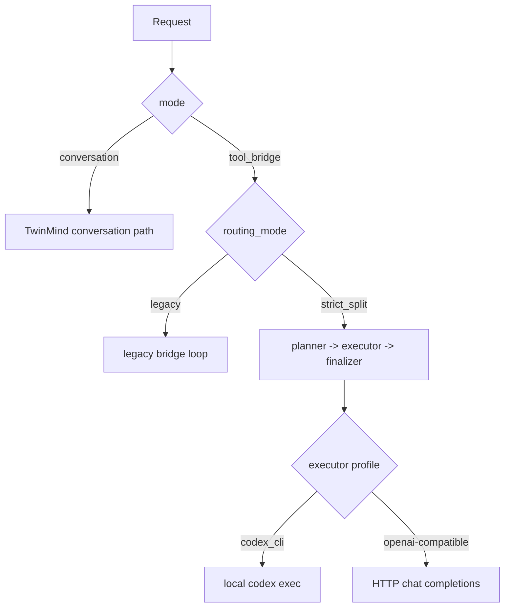

# Start Here

Back: [README](../README.md)

This page is for understanding the split architecture before you touch a live config.

## Core idea

1. Clawdbot calls the TwinMind wrapper as a CLI backend.
2. The wrapper decides between `conversation` and `tool_bridge` behavior.
3. Inside `tool_bridge`, routing chooses `legacy` or `strict_split`.
4. In `strict_split`, TwinMind plans and finalizes while a separate executor performs tool-structured work.

## The four terms that matter

| Term | Meaning |
|---|---|
| `conversation` | direct TwinMind chat path |
| `tool_bridge` | wrapper enforces JSON tool protocol |
| `legacy` | single-model bridge loop without hard planner/executor split |
| `strict_split` | TwinMind planner/finalizer plus external executor |

## What changes after migration

The migration does not turn everything into tool mode.

It patches the backend so that:

- the default backend mode stays `conversation`
- the routing mode becomes `strict_split`
- tool-intent requests can override into the split executor path
- provider/model defaults are pinned to Codex unless you edit the backend args

That last point matters: migrated configs include explicit `--executor-provider` and `--executor-model` args, so env-only switching is not enough.

## Safe trial vs live migration

Use the right document for the right job:

- safe local replica: [06-operations-runbook.md](./06-operations-runbook.md)
- live patch of a real config: [05-migration-guide.md](./05-migration-guide.md)
- rollback of a live patch: [08-rollback.md](./08-rollback.md)

## Support boundaries

- Clawdbot is the primary documented target.
- OpenClaw is supported only where it uses the same config shape and common config paths.
- WhatsApp gateway handling is explicit in the wrapper.
- Telegram and other non-WhatsApp channels are not transport-specific targets here; treat them as plain-text best effort only.
- Moltbook and Moltbot are only covered for Clawdbot-compatible config paths and config shape; there is no dedicated transport/runtime adapter here.

## Mental model

## Read next

1. [03-split-routing.md](./03-split-routing.md)
2. [10-model-profiles-and-credentials.md](./10-model-profiles-and-credentials.md)
3. [11-token-sourcing-safe.md](./11-token-sourcing-safe.md)

## Deep reference

- [02-wrapper-architecture.md](./02-wrapper-architecture.md)
- [04-config-reference.md](./04-config-reference.md)
- [09-script-reference.md](./09-script-reference.md)
- [analysis/line_refs.txt](../analysis/line_refs.txt)
