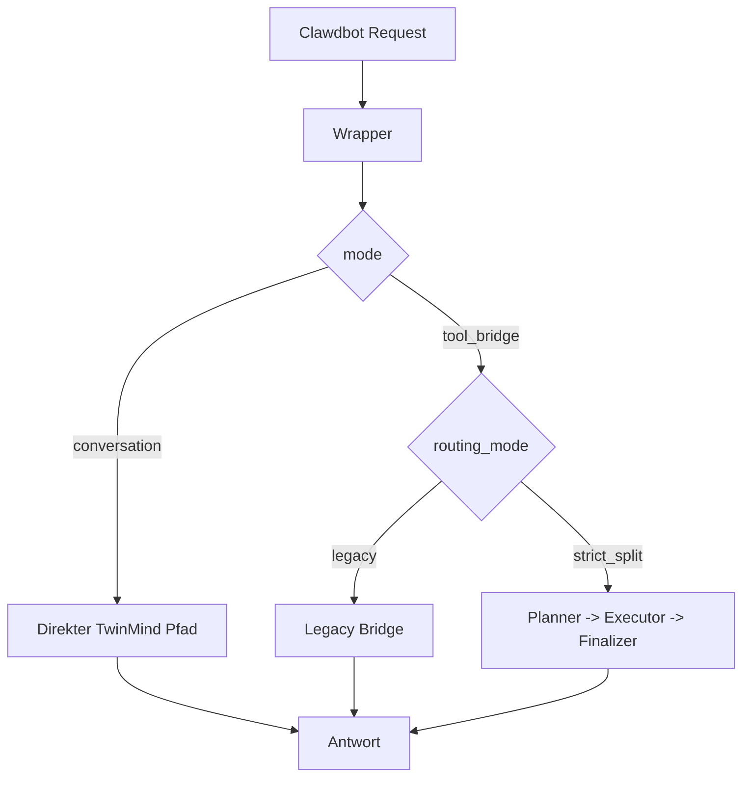

# Start Here: TwinMind Wrapper + Split-Logik

Zurück zur Startseite: [README](../README.md)

Diese Seite erklärt die Kernidee ohne tiefe Interna.

## Kernidee in 4 Sätzen
1. Clawdbot ruft als Backend den TwinMind Wrapper auf.
2. Der Wrapper entscheidet zwischen `conversation` und `tool_bridge`.
3. In `tool_bridge` wird zwischen `legacy bridge` und `strict_split` unterschieden.
4. Ziel ist kontrollierbares Routing, bessere Tool-Stabilität und nachvollziehbare Migration.

## Begriffe (kurz)
- `conversation`: Direkter TwinMind-Chatpfad.
- `tool_bridge`: Striktes Tool-Protokoll mit `tool_call` und `final`.
- `legacy bridge`: Ein-Brücken-Flow ohne harte Rollenaufteilung.
- `strict_split`: TwinMind plant/finalisiert, Executor führt aus.

## Einfaches Bild

## Was sollte ich als Neuling lesen?
1. [01-overview.md](./01-overview.md)
2. [03-split-routing.md](./03-split-routing.md)
3. [04-config-reference.md](./04-config-reference.md)

## Was sollte ich als Betreiber lesen?
1. [05-migration-guide.md](./05-migration-guide.md)
2. [06-operations-runbook.md](./06-operations-runbook.md)
3. [08-rollback.md](./08-rollback.md)

## Tiefe Technik
- [02-wrapper-architecture.md](./02-wrapper-architecture.md)
- [09-script-reference.md](./09-script-reference.md)
- [analysis/line_refs.txt](../analysis/line_refs.txt)
