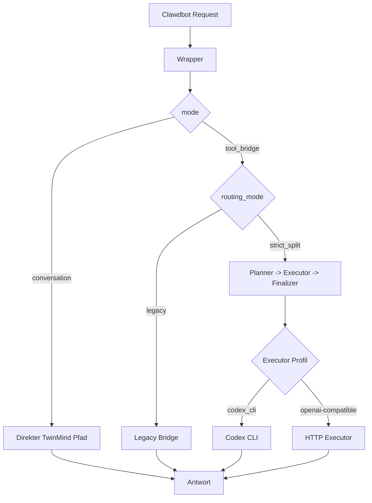

# Start Here: TwinMind Wrapper + Split-Logik

Zurueck zur Startseite: [README](../README.md)

Diese Seite erklaert die Kernidee ohne tiefe Interna.

## Kernidee in 4 Saetzen
1. Clawdbot ruft als Backend den TwinMind Wrapper auf.
2. Der Wrapper entscheidet zwischen `conversation` und `tool_bridge`.
3. In `tool_bridge` wird zwischen `legacy bridge` und `strict_split` unterschieden.
4. Ziel ist kontrollierbares Routing, bessere Tool-Stabilitaet und nachvollziehbare Migration.

## Begriffe (kurz)
- `conversation`: Direkter TwinMind-Chatpfad.
- `tool_bridge`: Striktes Tool-Protokoll mit `tool_call` und `final`.
- `legacy bridge`: Ein-Bruecken-Flow ohne harte Rollenaufteilung.
- `strict_split`: TwinMind plant/finalisiert, Executor fuehrt aus.

<strong>Legacy vs strict_split: Wann nehme ich was?</strong>

**Nimm `legacy bridge`, wenn:**
- du einen kompatiblen, durchgaengigen Bridge-Flow willst
- keine strikte Trennung von Planner und Executor brauchst

**Nimm `strict_split`, wenn:**
- du klare Rollen willst (Planner -> Executor -> Finalizer)
- Tool-Ausfuehrung und Antwort-Finalisierung sauber getrennt sein sollen

**Beispiel 1 (legacy):**
- Anfrage: "Zeig mir meine offenen Hausaufgaben."
- Ziel: schnelle kompatible Bridge-Antwort

**Beispiel 2 (strict_split):**
- Anfrage: "Suche relevante Memories, nutze mehrere Tools und gib mir eine saubere Endzusammenfassung."
- Ziel: kontrollierte, mehrstufige Ausfuehrung mit klarer Rollenlogik

<strong>Fastpath in der Praxis: Was passiert konkret?</strong>

Fastpaths sind kurze deterministische Routen fuer gut erkennbare Spezialfaelle.

**Beispiel:**
- Anfrage: "[cron] Run Schulcloud daily"
- Ergebnis: Wrapper springt direkt in den passenden Fastpath, statt den normalen Bridge-Loop zu starten.

**Warum wichtig?**
- reduziert Komplexitaet bei Standardaufgaben
- stabilisiert bekannte Ablaeufe
- spart unnoetige Modellrunden

## Welches Modell nehme ich?
- Default aus den Skripten: Codex (`codex_cli` + `gpt-5.3-codex`)
- Alternative: OpenAI-kompatibler HTTP-Executor (z. B. Gemini-kompatibles Endpoint)

Modellprofile:
- [10-model-profiles-and-credentials.md](./10-model-profiles-and-credentials.md)

Sichere Token-Beschaffung:
- [11-token-sourcing-safe.md](./11-token-sourcing-safe.md)

<strong>Praxisbeispiel: Codex-Profil</strong>

- Migration wie dokumentiert ausfuehren.
- Codex CLI muss lokal verfuegbar und authentifiziert sein.
- `strict_split` nutzt dann den lokalen `codex exec`-Pfad als Executor.

<strong>Praxisbeispiel: Gemini statt Codex</strong>

- Migration bleibt gleich (patcht zuerst Codex-Default).
- Danach Executor-Profil auf HTTP/OpenAI-kompatibel umstellen.
- Typisch: `ORCH_EXECUTOR_PROVIDER=openai` plus passendes `ORCH_EXECUTOR_BASE_URL`, `ORCH_EXECUTOR_MODEL`, `ORCH_EXECUTOR_API_KEY`.

## Einfaches Bild

## Was sollte ich als Neuling lesen?
1. [01-overview.md](./01-overview.md)
2. [03-split-routing.md](./03-split-routing.md)
3. [04-config-reference.md](./04-config-reference.md)
4. [10-model-profiles-and-credentials.md](./10-model-profiles-and-credentials.md)
5. [11-token-sourcing-safe.md](./11-token-sourcing-safe.md)

## Was sollte ich als Betreiber lesen?
1. [05-migration-guide.md](./05-migration-guide.md)
2. [06-operations-runbook.md](./06-operations-runbook.md)
3. [07-troubleshooting.md](./07-troubleshooting.md)
4. [08-rollback.md](./08-rollback.md)

## Tiefe Technik
- [02-wrapper-architecture.md](./02-wrapper-architecture.md)
- [09-script-reference.md](./09-script-reference.md)
- [analysis/line_refs.txt](../analysis/line_refs.txt)
