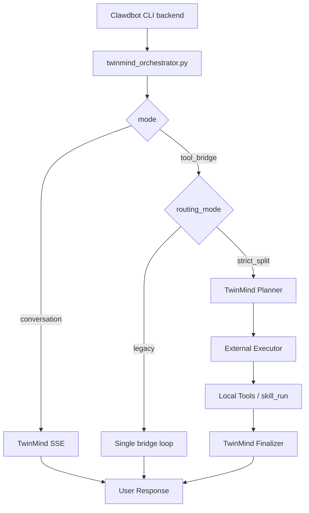
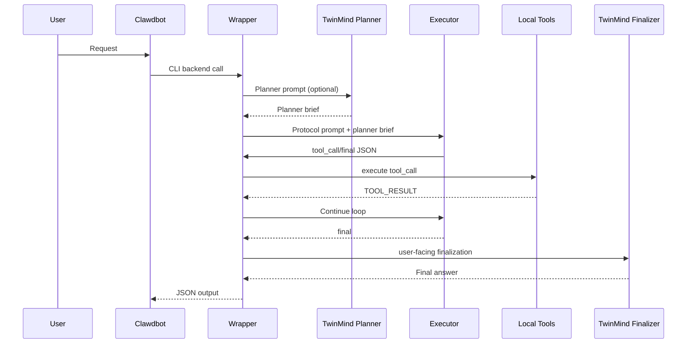

# Start Here: Split Logic + TwinMind Wrapper

This page is the architecture-first entrypoint.

## What this repository is about
1. TwinMind wrapper internals
2. Split routing behavior (`strict_split` vs `legacy`)
3. Deterministic tool-bridge execution loop
4. Migration/replication scripts around that core

## System view

## Execution sequence (`strict_split`)

## Read in this order
1. [01-overview.md](./01-overview.md)
2. [02-wrapper-architecture.md](./02-wrapper-architecture.md)
3. [03-split-routing.md](./03-split-routing.md)
4. [04-config-reference.md](./04-config-reference.md)
5. [09-script-reference.md](./09-script-reference.md)

## Then move to operations
- [05-migration-guide.md](./05-migration-guide.md)
- [06-operations-runbook.md](./06-operations-runbook.md)
- [08-rollback.md](./08-rollback.md)
- [07-troubleshooting.md](./07-troubleshooting.md)
