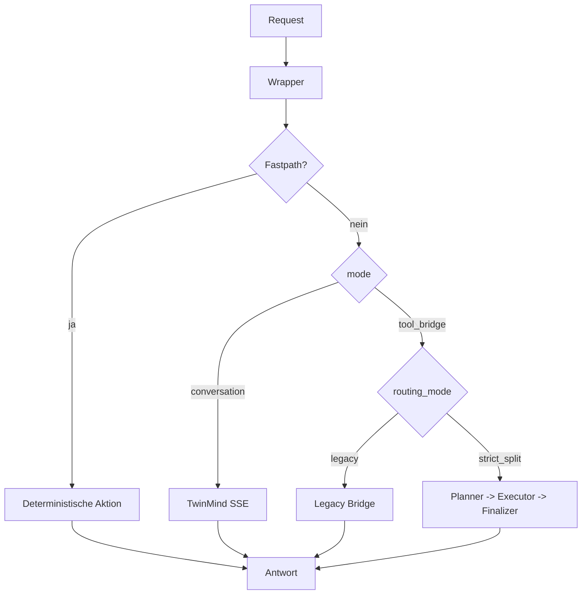

# Überblick

Zurück: [Start Here](./00-start-here.md) | Weiter: [Wrapper Architecture](./02-wrapper-architecture.md)

## Ziel
Dieses Kit dokumentiert und operationalisiert den TwinMind Wrapper mit Split-Routing für Clawdbot.

## Glossar (schnell)
- `conversation`: TwinMind antwortet direkt.
- `tool_bridge`: Wrapper erzwingt Tool-Protokoll.
- `legacy bridge`: Bridge-Modus ohne strikte Trennung von Planung und Ausführung.
- `strict_split`: Planner/Executor/Finalizer sind logisch getrennt.
- `fastpath`: deterministische Kurzroute (z. B. spezielle lokale Requests).

## Was ändert sich gegenüber Standard-Clawdbot?
- Ein dedizierter Wrapper wird primärer Backend-Einstieg.
- Routing ist explizit steuerbar (`mode`, `routing_mode`).
- Tool-Ausführung kann deterministisch in Split-Pfad laufen.
- Migration und Rollback sind als Skript-Workflow verfügbar.

## Core-Komponenten
- `vendor/twinmind_orchestrator.py`: Wrapper-Routing und Runtime
- `vendor/twinmind_memory_sync.py`: Memory-Index Aufbau
- `vendor/twinmind_memory_query.py`: lokale Memory-Abfragen

## Visual Summary

Nächste Schritte:
- [Wrapper Architecture](./02-wrapper-architecture.md)
- [Split Routing Logic](./03-split-routing.md)
- [Config Reference](./04-config-reference.md)
- [Model Profiles and Credentials](./10-model-profiles-and-credentials.md)
- [Token Sourcing (Safe)](./11-token-sourcing-safe.md)
