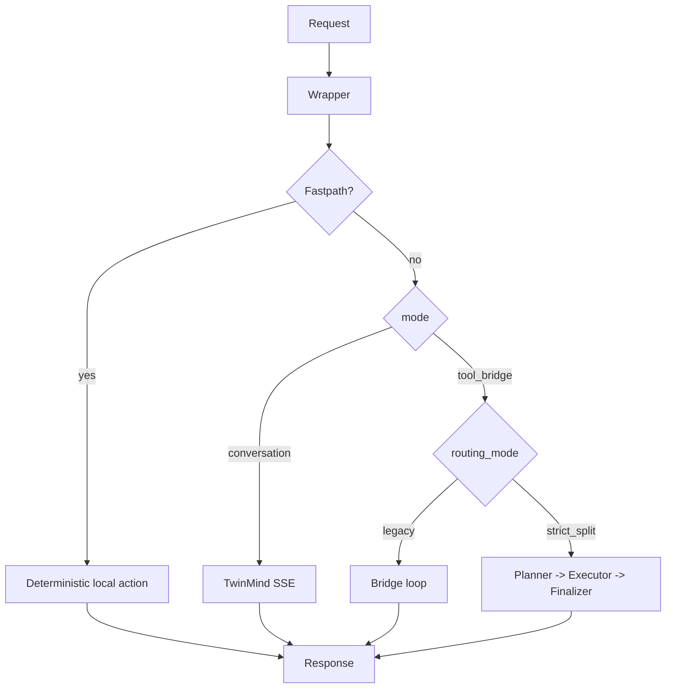

# Overview

Back to: [Start Here](./00-start-here.md)

## Goal
Standardize and explain the TwinMind wrapper + split routing stack for Clawdbot in a reproducible, migration-safe way.

## Core Components
- `vendor/twinmind_orchestrator.py`: wrapper runtime and routing core
- `vendor/twinmind_memory_sync.py`: TwinMind memory synchronization
- `vendor/twinmind_memory_query.py`: local memory lookup helper

## Core Modes
- `conversation`: TwinMind direct path
- `tool_bridge`: protocol-driven tool loop

## Split Modes
- `legacy`: non-split bridge behavior
- `strict_split`: TwinMind planner/finalizer + external executor

## Runtime Responsibilities
1. parse input and derive stable session identity
2. route request to fastpath, conversation, or bridge flow
3. enforce tool protocol and limits
4. keep gateway-safe output semantics (`text`/`json`)

## Visual Summary

Next:
- [Wrapper Architecture](./02-wrapper-architecture.md)
- [Split Routing Logic](./03-split-routing.md)
