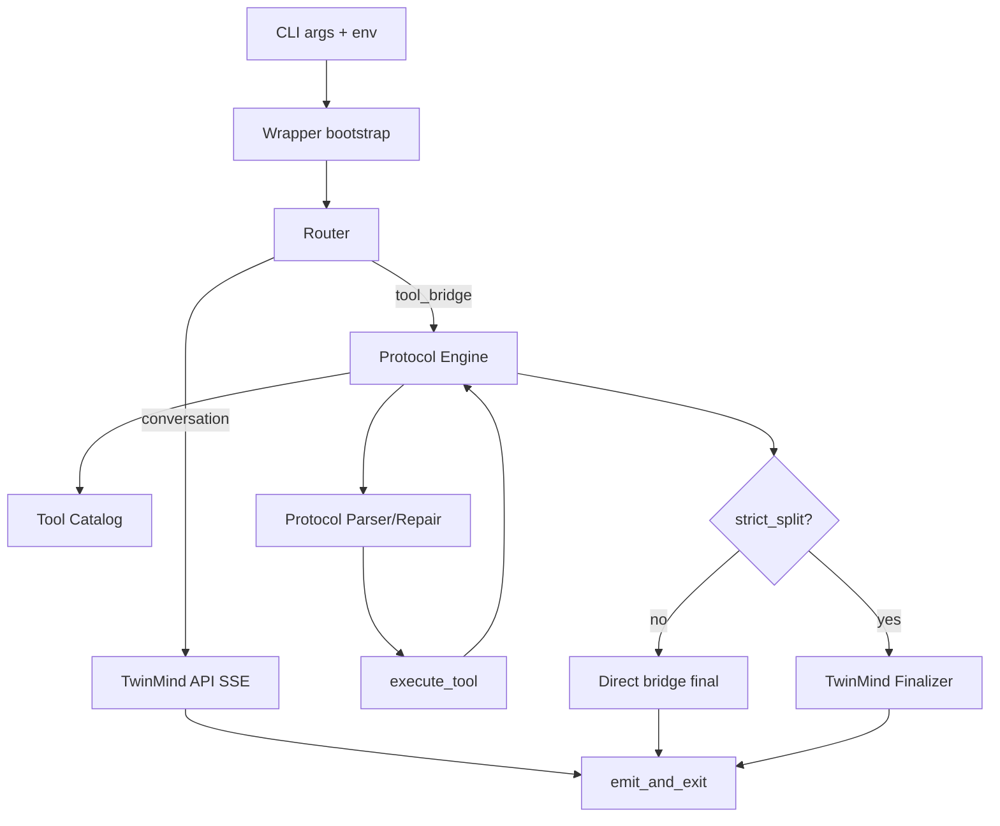

# Wrapper Architecture

Back: [Overview](./01-overview.md) | Forward: [Split Routing](./03-split-routing.md)

## Main executable
- `vendor/twinmind_orchestrator.py`

## Runtime phases
1. Bootstrap (env + args + session)
2. Input normalization (sanitization, optional preprocess)
3. Router decision (fastpath vs conversation vs bridge)
4. Execution path (TwinMind SSE or protocol loop)
5. Finalization + emit (`text` or `json`)

## Internal Subsystems

### Session and lock subsystem
- single-run lock to avoid overlapping tool execution
- session continuity per derived user key

### Protocol subsystem
- tool catalog generation
- strict protocol prompt generation
- parser + normalization
- bounded repair loop

### Tool subsystem
- curated `skill_run` actions
- restricted shell path (`allow_shell`/`allow_writes`)
- structured tool result forwarding

### Split subsystem (`strict_split`)
- optional planner brief from TwinMind
- executor performs deterministic loop
- final user response created by TwinMind finalizer

## Architecture Diagram

## Reference anchors
- CLI and route flags: see `analysis/line_refs.txt`
- parser loop and executor branch: see `analysis/line_refs.txt`
- final emit paths: see `analysis/line_refs.txt`

Next:
- [Split Routing Logic](./03-split-routing.md)
- [Config Reference](./04-config-reference.md)
