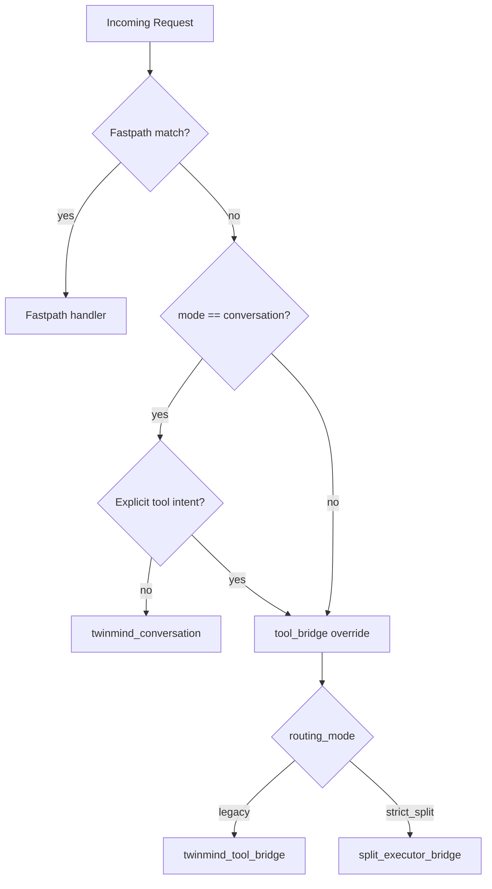

# Split Routing Logic

Back: [Wrapper Architecture](./02-wrapper-architecture.md) | Forward: [Config Reference](./04-config-reference.md)

## Inputs that drive routing
- `--mode` (`conversation`, `tool_bridge`)
- `--routing-mode` (`legacy`, `strict_split`)
- explicit tool intent in user query
- fastpath detectors for deterministic local workflows

## Route outcomes
- `twinmind_conversation`
- `twinmind_tool_bridge`
- `split_executor_bridge`
- deterministic fastpaths (`heartbeat`, `cron`, selected skill routes)

## Route Decision Diagram


## strict_split execution sequence
```mermaid
flowchart LR
    A[Planner prompt (optional)] --> B[Executor protocol loop]
    B --> C[Tool call execution]
    C --> B
    B --> D[Final action]
    D --> E[TwinMind finalizer]
    E --> F[User-facing response]
```

## Guardrails
- tool-call and step limits
- protocol repair attempts
- policy checks for shell and writes
- degrade safely instead of hard process crashes

## Observability
Look for these events in wrapper logs:
- `router_decision`
- `planner_brief_ready` / `planner_brief_failed`
- `protocol_error`
- `executor_failed`
- `final`

Next:
- [Config Reference](./04-config-reference.md)
- [Script Reference](./09-script-reference.md)
