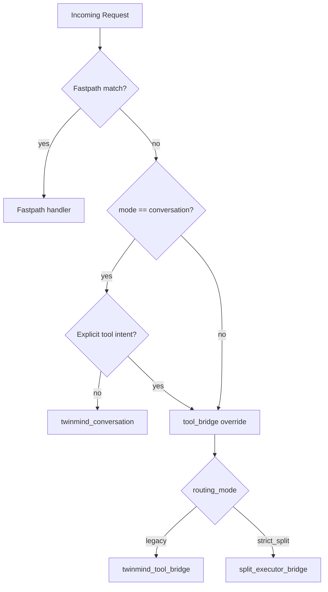
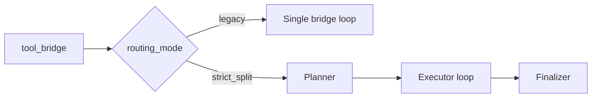

# Split Routing Logic

Zurück: [Wrapper Architecture](./02-wrapper-architecture.md) | Weiter: [Config Reference](./04-config-reference.md)

## Routing-Eingaben
- `--mode`: `conversation` oder `tool_bridge`
- `--routing-mode`: `legacy` oder `strict_split`
- erkannter Tool-Intent in der Anfrage
- Fastpath-Matches

## Route-Ergebnisse
- `twinmind_conversation`
- `twinmind_tool_bridge`
- `split_executor_bridge`
- fastpath-spezifische direkte Routen

## Entscheidungsbaum

## Was ist die Legacy Bridge?
`legacy bridge` ist der kompatible Bridge-Modus.

Eigenschaften:
- Kein harter Planner/Executor-Split.
- Ein Brückenpfad führt Protokoll, Tool-Aufrufe und finale Antwort zusammen.
- Gut für kompatibles Verhalten mit weniger Split-Komplexität.

Grenzen:
- Weniger klare Rollentrennung als `strict_split`.
- Debugging und Zuständigkeiten sind weniger strikt segmentiert.

## Was ist strict_split?
`strict_split` trennt Rollen klar:
1. TwinMind Planner (optional Brief)
2. Externer Executor (deterministische Tool-Protokollschritte)
3. TwinMind Finalizer (nutzerfreundliche Endantwort)

## Vergleich Legacy vs strict_split

## Guardrails
- Step-Limits
- Tool-Call-Limits
- Protocol-Repair-Attempts
- Shell/Write-Policies
- kontrollierte Fallbacks statt harter Abbrüche

## Observability
Wichtige Events:
- `router_decision`
- `planner_brief_ready` / `planner_brief_failed`
- `protocol_error`
- `executor_failed`
- `final`

Weiter:
- [04-config-reference.md](./04-config-reference.md)
- [09-script-reference.md](./09-script-reference.md)
