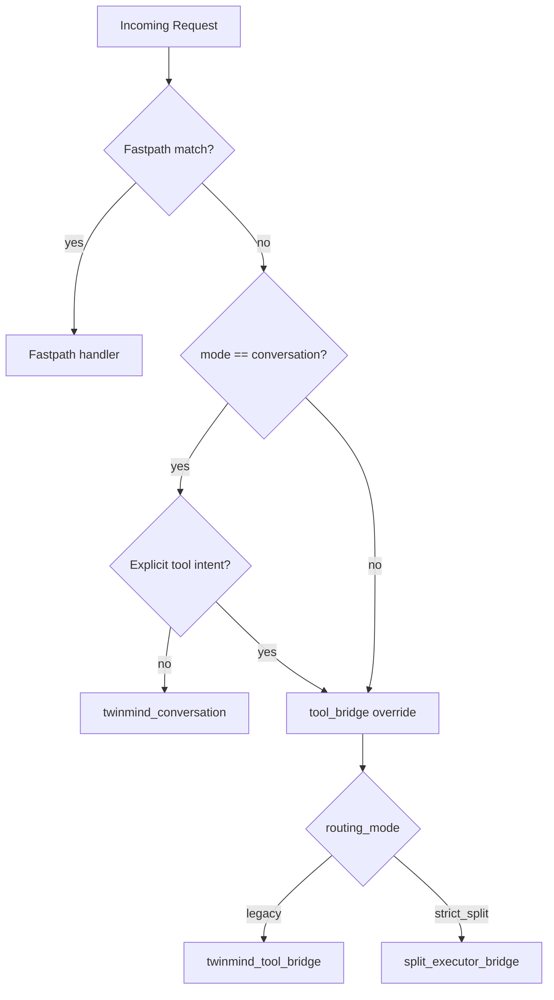
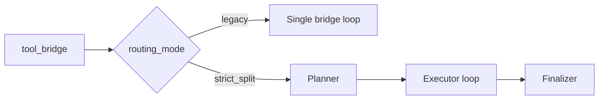

# Split Routing Logic

Zurück: [Wrapper Architecture](./02-wrapper-architecture.md) | Weiter: [Config Reference](./04-config-reference.md)

## Routing-Eingaben
- `--mode`: `conversation` oder `tool_bridge`
- `--routing-mode`: `legacy` oder `strict_split`
- erkannter Tool-Intent in der Anfrage
- erkannter Audio-Kontext (`[Audio] ... Transcript`, `<media:audio>`, Audio-Anhang)
- Fastpath-Matches

## Route-Ergebnisse
- `twinmind_conversation`
- `twinmind_tool_bridge`
- `split_executor_bridge`
- `audio_stt_unavailable_fastpath` (Audio empfangen, aber kein Transcript/STT verfuegbar)
- fastpath-spezifische direkte Routen

## Entscheidungsbaum

## Was ist die Legacy Bridge?
`legacy bridge` ist der kompatible Bridge-Modus.

Eigenschaften:
- Kein harter Planner/Executor-Split.
- Ein Brückenpfad führt Protokoll, Tool-Aufrufe und finale Antwort zusammen.
- Gut für kompatibles Verhalten mit weniger Split-Komplexität.

Grenzen:
- Weniger klare Rollentrennung als `strict_split`.
- Debugging und Zuständigkeiten sind weniger strikt segmentiert.

<strong>Legacy Bridge Deep Dive mit Beispiel</strong>

Die Legacy Bridge führt Planung, Tool-Aufruf und Antwort in einem kompatiblen Brückenpfad zusammen.

**Typischer Ablauf:**
1. Anfrage wird als `tool_bridge` erkannt.
2. Modell erzeugt Tool-Aufruf(e).
3. Wrapper führt Tool(s) aus.
4. Antwort wird im gleichen Brücken-Flow finalisiert.

**Realistisches Beispiel:**
- Anfrage: „Hol mir meine Sharezone-Hausaufgaben und sag kurz, was dringend ist.“
- Route: `twinmind_tool_bridge` mit `routing_mode=legacy`
- Ergebnis: Ein zusammenhängender Bridge-Lauf ohne separate Planner/Finalizer-Stufe.

## Was ist strict_split?
`strict_split` trennt Rollen klar:
1. TwinMind Planner (optional Brief)
2. Externer Executor (deterministische Tool-Protokollschritte)
3. TwinMind Finalizer (nutzerfreundliche Endantwort)

<strong>Fastpaths: Wer entscheidet das und was bedeutet es für Routing?</strong>

Fastpaths werden vom Wrapper über Regeln/Matcher entschieden, nicht manuell vom Nutzer.

**Heißt konkret:**
- Anfrage passt auf ein bekanntes deterministisches Muster -> direkter Fastpath
- kein Match -> normaler Conversation/Bridge-Entscheidungsbaum

**Realistisches Beispiel:**
- Anfrage: „HEARTBEAT status“
- Entscheidung: direkter Fastpath
- Wirkung: kein normaler Bridge-Loop nötig

## Vergleich Legacy vs strict_split

<strong>Tool-Protokoll Deep Dive (`tool_call`, `final`, Repair) mit Beispiel</strong>

Im Bridge-Pfad erwartet der Wrapper strukturierte Aktionen:
- `tool_call`: Tool ausführen
- `final`: finale Nutzerantwort

Bei ungültigem Ausgabeformat läuft ein begrenzter Repair-Mechanismus, damit der Prozess stabil bleibt.

**Realistisches Beispiel:**
- Anfrage: „Suche meine Mathe-Memories und gib mir 3 Kernpunkte.“
- Schritt 1: Executor liefert `tool_call` für Memory-Suche
- Schritt 2: Wrapper führt Tool aus und liefert TOOL_RESULT zurück
- Schritt 3: Executor liefert `final`
- Wenn Schritt 1/3 formal ungültig ist: Repair-Prompt greift (begrenzt)

## Guardrails
- Step-Limits
- Tool-Call-Limits
- Protocol-Repair-Attempts
- Shell/Write-Policies
- kontrollierte Fallbacks statt harter Abbrüche

## Audio Sonderregel
- Audio-Nachrichten mit vorhandenem Transcript bleiben bevorzugt im `twinmind_conversation`-Pfad.
- Der Wrapper zieht dafuer den Transcript-Text als `conversation_query` vor und entzieht Audio-Nachrichten dem strikten Tool-Intent, solange kein expliziter Tool-Wunsch vorliegt.
- Wenn ein Audio-Anhang vorliegt, aber kein Transcript geliefert werden konnte, endet der Lauf deterministisch in `audio_stt_unavailable_fastpath`.

## Websearch Fallback
- Bei Web-Recherche-Anfragen kann der Wrapper lokale Suche nutzen, wenn TwinMind:
  - mit HTTP-Fehler endet oder
  - explizit meldet, dass Websuche/Browsing nicht verfuegbar ist
- Reihenfolge:
  - Brave mit Rate-Gate + Retry
  - optional SearXNG als Fallback
- Die lokale Websuche bleibt im `twinmind_conversation`-Pfad ein Antwort-Fallback; sie ersetzt nicht den normalen Split-Executor.

## Observability
Wichtige Events:
- `router_decision`
- `routing_adjustment`
- `planner_brief_ready` / `planner_brief_failed`
- `protocol_error`
- `executor_failed`
- `fallback_triggered` / `fallback_skipped`
- `final`

Weiter:
- [04-config-reference.md](./04-config-reference.md)
- [09-script-reference.md](./09-script-reference.md)
