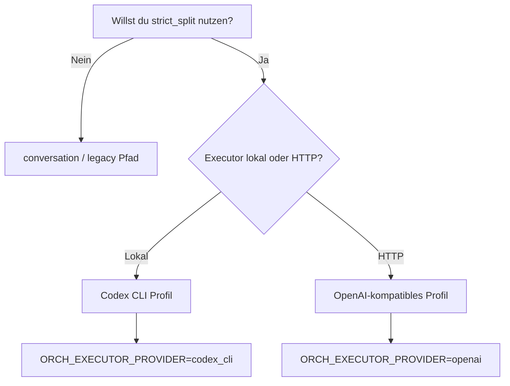

# Model Profiles and Credential Mapping

Zurueck: [README](../README.md) | Weiter: [11-token-sourcing-safe.md](./11-token-sourcing-safe.md)

Diese Seite beschreibt, wie `strict_split` mit unterschiedlichen Executor-Modellen betrieben wird, ohne Codeaenderung am Wrapper.

## Kurzfassung
- Standard aus den Skripten: `codex_cli` + `gpt-5.3-codex`
- Alternative: OpenAI-kompatibler HTTP-Executor (z. B. Gemini-kompatibles Endpoint)
- TwinMind Tokens (`TWINMIND_REFRESH_TOKEN`, `TWINMIND_FIREBASE_API_KEY`) bleiben in beiden Faellen erforderlich.

## Entscheidungsbaum


## Profil 1: Codex (Default)

### Minimal-Konfiguration
```env
ORCH_EXECUTOR_PROVIDER=codex_cli
ORCH_EXECUTOR_MODEL=gpt-5.3-codex
```

### Voraussetzungen
- `codex` CLI ist installiert und im `PATH`.
- Codex Auth ist aktiv.
- Modellzugriff fuer `ORCH_EXECUTOR_MODEL` ist vorhanden.

<details>
<summary><strong>Wann ist Codex die bessere Wahl?</strong></summary>

Codex ist sinnvoll, wenn du den lokalen CLI-Pfad bereits stabil betreibst und eine reproduzierbare Basis-Migration willst.

**Beispiel:**
- Team standardisiert auf ein internes Linux-Setup mit vorinstallierter Codex-CLI.
- Ziel ist ein einheitlicher Default, den alle ohne zusaetzliche HTTP-Endpoint-Konfiguration nutzen.

</details>

## Profil 2: OpenAI-kompatibler HTTP-Executor (z. B. Gemini)

### Minimal-Konfiguration
```env
ORCH_EXECUTOR_PROVIDER=openai
ORCH_EXECUTOR_MODEL=<dein-modellname>
ORCH_EXECUTOR_BASE_URL=<dein-openai-kompatibles-base-url>
ORCH_EXECUTOR_API_KEY=<dein-api-key>
```

### Voraussetzungen
- Endpoint ist kompatibel zum Chat-Completions-Format.
- API-Key ist gueltig.
- Modellname ist auf dem Endpoint verfuegbar.

<details>
<summary><strong>Was bedeutet "OpenAI-kompatibel" in diesem Repo?</strong></summary>

Der Wrapper sendet Executor-HTTP-Requests an:
- `<ORCH_EXECUTOR_BASE_URL>/chat/completions`

Das Zielsystem muss daher ein kompatibles Request/Response-Schema liefern, damit der Wrapper die Antwort als Text extrahieren kann.

</details>

<details>
<summary><strong>Beispielablauf: Migration mit Codex-Default, danach auf Gemini umstellen</strong></summary>

1. Migration normal ausfuehren (schreibt Codex-Defaultwerte).
2. Danach in der Runtime `.env` die `ORCH_EXECUTOR_*` Werte auf HTTP-Profil setzen.
3. In Logs pruefen, dass `executor_request` nicht mehr `provider=codex_cli` zeigt, sondern HTTP-URL.

</details>

## Mapping: Variable -> Funktion

| Variable | Bedeutung |
|---|---|
| `ORCH_ROUTING_MODE` | Steuerung von `legacy` vs `strict_split` |
| `ORCH_EXECUTOR_PROVIDER` | Entscheidet CLI- vs HTTP-Executor-Pfad |
| `ORCH_EXECUTOR_MODEL` | Modell fuer den Executor |
| `ORCH_EXECUTOR_BASE_URL` | HTTP-Basis fuer kompatible Endpoints |
| `ORCH_EXECUTOR_API_KEY` | Auth fuer HTTP-Executor |
| `OPENAI_API_KEY` | Alternativer Key fuer `openai`-artige Provider |

## Sicherheits-Hinweise
- Niemals echte Keys/Tokens committen.
- Keine Klartext-Secrets in Reports, Issues oder Screenshots.
- Rotation bei Verdacht auf Leck.

Weiter:
- [04-config-reference.md](./04-config-reference.md)
- [06-operations-runbook.md](./06-operations-runbook.md)
- [07-troubleshooting.md](./07-troubleshooting.md)
- [11-token-sourcing-safe.md](./11-token-sourcing-safe.md)
